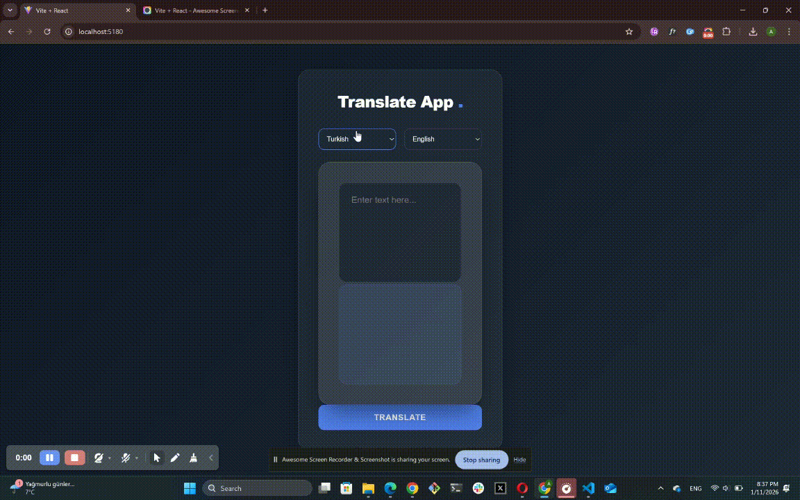

# 🌍 LingoLink - Modern Çeviri Uygulaması

Bu proje, kullanıcıların metinleri farklı dillere anlık olarak çevirebilmesini sağlayan, kullanıcı dostu ve hızlı bir web uygulamasıdır. Karmaşık süreçleri sade bir arayüzle sunarak dil bariyerlerini ortadan kaldırmayı hedefler.

## 🚀 Öne Çıkan Özellikler

* **Akıllı Metin Çevirisi:** Girilen metni seçilen hedef dile saniyeler içinde çevirir.
* **Otomatik Dil Algılama:** Kaynak metnin hangi dilde olduğunu (Auto-detect) sistem kendisi bulur.
* **Görsel Geri Bildirim:** Çeviri sırasında "Yükleniyor..." durumu ile kullanıcıyı bilgilendirir.
* **Modern Tasarım:** Karanlık mod destekli, temiz ve şık bir kullanıcı arayüzü.

## 🛠️ Kullanılan Teknolojiler

| Teknoloji | Kullanım Amacı |
| :--- | :--- |
| **React** | Bileşen tabanlı arayüz yönetimi |
| **Redux Toolkit** | Global state ve veri akışı yönetimi |
| **Axios** | API isteklerinin yönetimi |
| **RapidAPI** | Deep Translate API entegrasyonu |
| **CSS3 / SCSS** | Modern ve duyarlı (responsive) tasarım |

## 💡 Bu Proje Bana Ne Öğretti?

Bu geliştirme süreci benim için şunları deneyimleme fırsatı oldu:

1.  **Global State Yönetimi:** Redux Toolkit kullanarak verinin uygulama içindeki karmaşık yolculuğunu merkezi bir noktadan kontrol etmeyi.
2.  **Asenkron İşlemler:** `createAsyncThunk` yapısı ile API'den gelen verilerin yüklenme (pending), başarı (fulfilled) ve hata (rejected) durumlarını profesyonelce yönetmeyi.
3.  **Hata Yönetimi:** API limitleri veya bağlantı hataları gibi durumlarda kullanıcıya anlamlı geri bildirimler vermeyi.
4.  **UX Odaklı Geliştirme:** Kullanıcının en az tıklama ile en doğru sonuca ulaşmasını sağlayacak bir kullanıcı deneyimi kurmayı.

---

## 🔍 Önizleme

